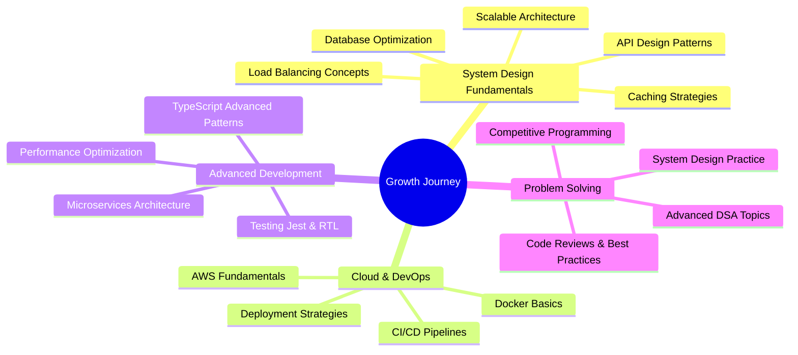

<div align="center">
  


</div>

<h1 align="center">Hi  I'm <b>Saurabh</b></h1>

<h2 align="center"><b>Aspiring Full Stack Developer | Building the Future, One Line at a Time 💻✨</b></h2> 

<p align="center"><b>Aspiring MERN Stack Developer | 350+ DSA Problems Solved 🧠 | AI Integration Enthusiast 🤖 | Building Production-Ready Applications 🚀 | Next.js & TypeScript Explorer | Open to SDE Opportunities | Razorpay & GenAI Integration | Event-Driven Architecture | 7th Sem CSE(AI & ML) Student | CGPA: 7.5/10 | Galgotias College of Engineering | Real-Time Features Developer | Passionate Problem Solver | Always Learning, Always Growing 🌱 | Turning Ideas into Reality through Code 💡</b></p>

<p align="center">
 <a href="https://www.linkedin.com/in/saurabh-pandey-b52240269" target="_blank">
  
 </a>
 <a href="https://github.com/Theapsaurabh" target="_blank">
  
 </a>
 <a href="https://leetcode.com/u/Theapsaurabh13/" target="_blank">
  
 </a>
 <a href="https://www.geeksforgeeks.org/user/theampsaurabh/" target="_blank">
  
 </a>
 <a href="https://x.com/ampsaurabh" target="_blank">
  
 </a>
 <a href="https://www.instagram.com/theapsaurabh/" target="_blank">
  
 </a>
 <a href="mailto:ampsaurabh88877@gmail.com" target="_blank">
  
 </a>
</p>

<div align="center">
  
### 🌟 *"Aspiring to build impactful solutions that make a difference"* 🌟

</div>

---


## 👨‍💻 About Me

```javascript
const saurabh = {
    currentStatus: "🎓 Final Year Student (7th Sem)",
    location: "Greater Noida, Uttar Pradesh, India 🇮🇳",
    education: "B.Tech CSE (AI & ML) | GCET | CGPA: 7.5/10",
    aspiration: "Aspiring MERN Stack Developer",
    expertise: ["Full Stack Development", "AI Integration", "DSA"],
    currentlyBuilding: ["SageMate", "Prescripto", "Real-time Apps"],
    currentlyLearning: ["System Design", "DevOps", "Cloud Tech"],
    achievement: "350+ DSA Problems Conquered 🏆",
    experience: "IBM SkillBuild Frontend Intern",
    lookingFor: "SDE Opportunities | Internships | Collaborations",
    availableFor: "Freelance | Open Source | Learning Together",
    mindset: "Growth-oriented, Curious, Persistent",
    funFact: "I debug with console.log() and I'm not ashamed! 😄"
};
```

### 🚀 Quick Highlights

- 🎓 **Final Year Student** pursuing B.Tech in CSE (AI & ML) at GCET
- 💻 **Aspiring MERN Stack Developer** with hands-on production experience
- 🤖 Built **AI-powered mental health platform** (SageMate) with GenAI integration
- 🏥 Developed **full-stack healthcare system** (Prescripto) with payment gateway
- 🧠 Solved **350+ DSA problems** across LeetCode & GeeksforGeeks
- 🔥 Strong foundation in **Next.js, TypeScript, Event-Driven Architecture**
- 🎯 **IBM SkillBuild Certified** Frontend Developer
- 🌱 Constantly learning and evolving in the tech space
- 💬 Ask me about **React, Node.js, MongoDB, DSA, AI Integration**
- 📫 Reach me: **ampsaurabh88877@gmail.com** | **+91-7355018077**
- ⚡ Life Motto: **"Learn → Build → Ship → Repeat"**

---

## 💼 Featured Projects

<div align="center">

### 🎯 Projects That I'm Proud Of

</div>

<table>
<tr>
<td width="50%" valign="top">

<div align="center">

### 🧠 SageMate - AI Mental Health Companion


</div>

<div align="center">

<a href="https://sagemate-frontend.onrender.com" target="_blank">
  
</a>
<a href="https://github.com/Theapsaurabh/sagemate" target="_blank">
  
</a>

</div>

**🛠️ Tech Stack:**  


**✨ Key Features:**
- 🤖 **AI-Powered Therapy Sessions** with Google GenAI
- 📊 **Interactive Analytics Dashboard** with mood tracking
- 🔒 **Enterprise-Grade Security** (JWT + bcrypt encryption)
- ⚡ **Event-Driven Architecture** using Inngest for async tasks
- 🎯 **Real-Time Coping Strategies** & personalized guidance
- 📈 **Goal Management System** with progress tracking
- 💬 **Context-Aware Therapeutic Dialogues**

**🌟 Impact:**
> *"Building a safe space for mental wellness with AI-driven personalized support"*

**🎓 What I Learned:**
- AI integration in production apps
- Event-driven architecture patterns
- Secure authentication flows
- Real-time data processing

</td>
<td width="50%" valign="top">

<div align="center">

### 🏥 Prescripto - Doctor Appointment System


</div>

<div align="center">

<a href="https://prescripto-frontend.onrender.com" target="_blank">
  
</a>
<a href="https://github.com/Theapsaurabh/prescripto" target="_blank">
  
</a>

</div>

**🛠️ Tech Stack:**  


**✨ Key Features:**
- 📅 **Smart Appointment Booking** with real-time availability
- 💳 **Secure Payment Integration** via Razorpay
- 👥 **Multi-Role Dashboards** (Patient/Doctor/Admin)
- 🔐 **JWT Authentication** & role-based access control
- 📊 **Admin Analytics Panel** with insights
- ⚡ **Optimized MongoDB Queries** for fast performance
- 📱 **Responsive Design** for all devices

**🌟 Impact:**
> *"Simplifying healthcare access with seamless appointment management and secure payments"*

**🎓 What I Learned:**
- Payment gateway integration
- Role-based authorization
- State management at scale
- RESTful API design
- Database query optimization

</td>
</tr>
</table>

---

## ❤️ I Code on (DSA Platforms)

<div align="center">

### 🏆 Where I Sharpen My Problem-Solving Skills

<p align="center"> 
<a href="https://leetcode.com/u/Theapsaurabh13/" target="_blank">
  
</a>
<a href="https://www.geeksforgeeks.org/user/theampsaurabh/" target="_blank">
  
</a>
<a href="https://www.codechef.com/" target="_blank">
  
</a>
<a href="https://codeforces.com/" target="_blank">
  
</a>
<a href="https://www.hackerrank.com/" target="_blank">
  
</a>
</p>

</div>

---

## 🏆 Achievements & Milestones

<div align="center">

### 🎯 My Journey So Far


| 🎯 Metric | 📈 Achievement | 🔥 Status |
|-----------|----------------|-----------|
| 💻 **DSA Problems Solved** |  | **Grinding Daily** 🔥 |
| 🚀 **Production Apps Built** |  | **Deployed & Running** ✅ |
| 🔧 **Technologies Mastered** |  | **Still Exploring** 🌱 |
| 📜 **Certifications Earned** |  | **Certified Developer** 🎓 |
| ⭐ **GitHub Activity** |  | **Building Publicly** 🏗️ |
| 🎓 **Academic Performance** |  | **Consistent Learner** 📚 |
| 💼 **Internship Experience** |  | **Frontend Dev** 💻 |

</div>

---

## 🏆 DSA Battleground Stats

<div align="center">

### 📊 My Coding Journey in Numbers


**🌟 Academic Highlights:**
- Consistent performer with 7.5 CGPA
- Strong foundation in DSA and core CS subjects
- Active participation in coding clubs
- Focus on practical implementation
- Building projects alongside academics

</td>
</tr>
</table>

### 💼 Professional Experience

<table>
<tr>
<td width="100%">

**🏢 IBM SkillBuild Virtual Internship** | 🌐 Remote  
**👨‍💻 Role:** Frontend Development Intern  
**📅 Duration:** Jul 2025 – Aug 2025

**🎯 Key Responsibilities & Learnings:**
- ✅ Completed intensive **frontend development training** covering HTML5, CSS3, JavaScript ES6+, and React.js
- ✅ Mastered modern **state management patterns** using Redux and React Hooks
- ✅ Built responsive user interfaces with **best practices in component architecture**
- ✅ Hands-on project implementation with **real-world scenarios**
- ✅ Learned **React ecosystem** including routing, forms, and API integration
- ✅ Gained experience in **debugging** and **performance optimization**
- ✅ Collaborated with mentors and fellow interns virtually

**💡 Skills Gained:**
`React.js` • `Redux` • `React Hooks` • `Responsive Design` • `Component Architecture` • `State Management`

</td>
</tr>
</table>

---

## 📜 Certifications & Achievements

<div align="center">

### 🏆 Recognition & Growth


</div>

<table align="center">
<tr>
<td align="center">

**🎓 IBM SkillsBuild**  
Frontend Development  
*Certified - Aug 2025*

</td>
<td align="center">

**🎓 Full Stack Web Development**  
Complete MERN Stack  
*Certified - 2025*

</td>
<td align="center">

**💻 350+ DSA Problems**  
LeetCode & GeeksforGeeks  
*Ongoing Journey*

</td>
</tr>
<tr>
<td align="center">

**🚀 2+ Production Apps**  
Live & Deployed  
*SageMate & Prescripto*

</td>
<td align="center">

**🔥 AI Integration**  
Google GenAI  
*Hands-on Experience*

</td>
<td align="center">

**💳 Payment Gateway**  
Razorpay Integration  
*Production Ready*

</td>
</tr>
</table>

---

## 💡 Currently Learning & Exploring

<div align="center">

### 🌱 My Growth Path



</div>

<div align="center">

| 🔭 **Current Focus** | 📚 **Learning Path** | 🎯 **Goal** |
|---------------------|---------------------|------------|
| Advanced System Design | Designing scalable systems | Build production-grade apps |
| Docker & Kubernetes | Containerization basics | Deploy complex applications |
| AWS Cloud Services | EC2, S3, Lambda | Cloud-native development |
| GraphQL | Modern API development | Alternative to REST |
| Testing Frameworks | Jest, React Testing Library | Write robust test suites |

</div>

---

## 🐍 Contribution Snake

<div align="center">

### 🎮 Watch My Contributions Come Alive!

<picture>
  <source media="(prefers-color-scheme: dark)" srcset="https://raw.githubusercontent.com/Theapsaurabh/Theapsaurabh/output/github-contribution-grid-snake-dark.svg">
  <source media="(prefers-color-scheme: light)" srcset="https://raw.githubusercontent.com/Theapsaurabh/Theapsaurabh/output/github-contribution-grid-snake.svg">
  
</picture>

</div>

---

## 🏆 GitHub Trophies

<div align="center">

### 🎖️ Achievements Unlocked

<p align="center">
  
</p>

</div>

---

## 📌 Pinned Repositories

<div align="center">

### ⭐ My Best Work

</div>

<p align="center">
    <a href="https://github.com/Theapsaurabh/sagemate">
        
    </a>
    <a href="https://github.com/Theapsaurabh/prescripto">
        
    </a>
</p>

---

## 🎯 2025 Goals & Aspirations

<div align="center">

### 🚀 What I'm Working Towards

</div>

<table>
<tr>
<td width="33%" align="center">

**💼 Career Goals**

🎯 Land SDE role at product company  
📈 Contribute to impactful projects  
🤝 Work with talented teams  
💡 Build scalable solutions  
🌟 Make a real difference

</td>
<td width="33%" align="center">

**📚 Learning Goals**

🧠 Master System Design  
☁️ Learn Cloud Technologies  
🐳 Docker & Kubernetes  
🧪 Testing & CI/CD  
📊 Advanced DSA patterns

</td>
<td width="33%" align="center">

**🚀 Project Goals**

🔨 Build 2 more production apps  
🌐 Contribute to open source  
📝 Write technical blogs  
👨‍🏫 Help aspiring developers  
🎥 Create coding tutorials

</td>
</tr>
</table>

---

## 🤝 Let's Connect & Collaborate!

<div align="center">

### 💬 I'm Always Open To


</div>

<div align="center">

🎯 **SDE Opportunities & Internships**  
🚀 **Freelance Web Development Projects**  
💡 **Open Source Collaborations**  
📈 **Mentorship & Learning Together**  
🤔 **Tech Discussions & Problem Solving**  
☕ **Coffee Chats About Code & Career**

</div>

### 📫 Reach Out To Me

<div align="center">

<table>
<tr>
<td align="center" width="200">

**💼 Professional**

<a href="https://www.linkedin.com/in/saurabh-pandey-b52240269" target="_blank">
  
</a>

<a href="mailto:ampsaurabh88877@gmail.com" target="_blank">
  
</a>

<a href="tel:+917355018077" target="_blank">
  
</a>

</td>
<td align="center" width="200">

**💻 Coding Platforms**

<a href="https://github.com/Theapsaurabh" target="_blank">
  
</a>

<a href="https://leetcode.com/u/Theapsaurabh13/" target="_blank">
  
</a>

<a href="https://www.geeksforgeeks.org/user/theampsaurabh/" target="_blank">
  
</a>

</td>
<td align="center" width="200">

**🌐 Social Media**

<a href="https://x.com/ampsaurabh" target="_blank">
  
</a>

<a href="https://www.instagram.com/theapsaurabh/" target="_blank">
  
</a>

</td>
</tr>
</table>

</div>

<div align="center">

**📧 Email:** ampsaurabh88877@gmail.com  
**📱 Phone:** +91-7355018077  
**📍 Location:** Greater Noida, Uttar Pradesh, India

</div>

---

## 💭 Random Dev Wisdom

<div align="center">


</div>

---

## 📊 Profile Analytics

<div align="center">

### 👀 Profile Visitors & Stats


<a href="https://github.com/Theapsaurabh?tab=followers">
  
</a>

<a href="https://github.com/Theapsaurabh?tab=repositories">
  
</a>

<a href="https://github.com/Theapsaurabh">
  
</a>

</div>

---

<div align="center">

### 💖 Thanks for Visiting My Profile!


<br><br>

**⚡ Life Philosophy**

*"First, solve the problem. Then, write the code."* – John Johnson

*"The only way to do great work is to love what you do."* – Steve Jobs

*"Code is like humor. When you have to explain it, it's bad."* – Cory House

<br>

---

### 🌟 *Aspiring Developer | Problem Solver | Lifelong Learner*

---

<br>

**Made with ❤️, ☕, and countless hours of debugging by Saurabh Arimardan Pandey**


