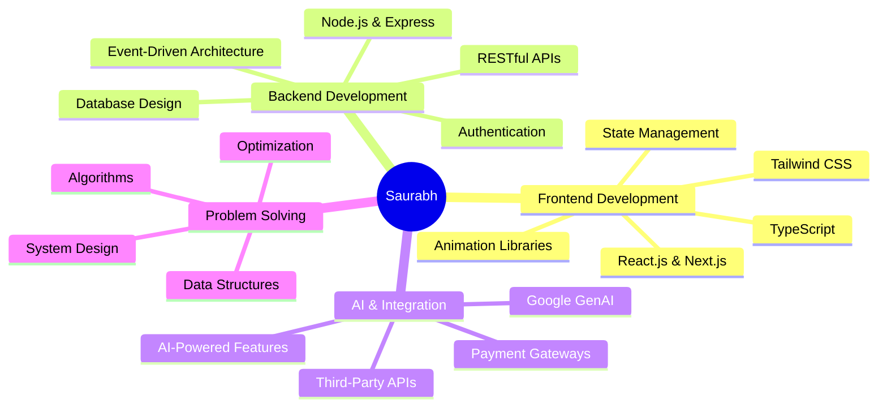

<div align="center">
  
# 👋 Hello, I'm Saurabh Arimardan Pandey

### 🚀 Full Stack Developer | MERN Specialist | AI Integration Enthusiast


</div>

---

## 🎯 About Me

```typescript
const saurabh = {
    location: "Greater Noida, India 🇮🇳",
    education: "B.Tech in CSE (AI & ML) | GCET",
    currentFocus: ["Building Production Apps", "AI Integration", "DSA Mastery"],
    lookingFor: "Full Stack Developer Roles | SDE Opportunities",
    funFact: "I debug with console.log and I'm not ashamed! 😄"
};
```

<div align="center">

[](https://your-portfolio.com)
[](https://linkedin.com/in/yourprofile)
[](https://leetcode.com/yourprofile)
[](mailto:ampsaurabh88877@gmail.com)

</div>

---

## 💼 Featured Projects

<table>
<tr>
<td width="50%">

### 🧠 SageMate - AI Mental Health Companion
*Next.js • MongoDB • Express • GenAI • Inngest*

🎯 AI-powered mental health platform with personalized therapy sessions and real-time coping strategies

**Key Features:**
- 🤖 Google GenAI integration for context-aware dialogues
- 📊 Comprehensive analytics dashboard with mood tracking
- 🔒 Enterprise-grade security (JWT + bcrypt)
- ⚡ Event-driven architecture using Inngest

[](https://your-demo-link.com)
[](https://github.com/yourusername/sagemate)

</td>
<td width="50%">

### 🏥 Prescripto - Doctor Appointment System
*React • Node.js • MongoDB • Razorpay*

💊 Full-stack healthcare platform for seamless appointment booking and payment processing

**Key Features:**
- 📅 Real-time appointment scheduling
- 💳 Secure Razorpay payment integration
- 👥 Role-based dashboards (Patient/Doctor/Admin)
- 🔐 JWT authentication & authorization

[](https://your-demo-link.com)
[](https://github.com/yourusername/prescripto)

</td>
</tr>
</table>

---

## 🛠️ Tech Stack

<div align="center">

### Languages


### Frontend


### Backend & Database


### Tools & Technologies


</div>

---

## 📊 GitHub Statistics

<div align="center">
  


</div>

---

## 🏆 Achievements & Milestones

<div align="center">

| 🎯 Metric | 📈 Achievement |
|-----------|----------------|
| 💻 **DSA Problems Solved** |  |
| 🚀 **Production Apps** |  |
| 🔧 **Technologies Mastered** |  |
| 📜 **Certifications** |  |
| ⭐ **GitHub Stars** |  |

</div>

---

## 📈 Coding Stats

<div align="center">

### LeetCode Progress


### WakaTime Stats (This Week)

<!--START_SECTION:waka-->
<!--END_SECTION:waka-->

</div>

---

## 🎓 Certifications & Experience

```javascript
const experience = [
    {
        role: "Frontend Development Intern",
        company: "IBM SkillBuild (Virtual)",
        duration: "Jul 2025 - Aug 2025",
        skills: ["React.js", "Redux", "JavaScript ES6+", "UI/UX"],
        achievement: "Completed intensive training with hands-on projects"
    }
];

const certifications = [
    "✅ Frontend Development - IBM SkillsBuild",
    "✅ Full Stack Web Development",
    "🎯 350+ DSA Problems (LeetCode & GeeksforGeeks)"
];
```

---

## 🌟 Core Competencies

<div align="center">



</div>

---

## 💡 What I'm Currently Learning

<div align="center">

| 🔭 Current Focus | 📚 Learning Path |
|------------------|------------------|
| Advanced System Design | Designing scalable architectures |
| Docker & Kubernetes | Containerization & orchestration |
| GraphQL | Modern API development |
| Testing (Jest, RTL) | Writing robust test suites |
| AWS Services | Cloud deployment & management |

</div>

---

## 🤝 Let's Connect & Collaborate

<div align="center">

### 💬 Open to discussing:

🎯 Full Stack Development Opportunities  
🚀 Freelance Projects & Collaborations  
💡 Open Source Contributions  
📈 Tech Trends & Best Practices  
☕ Coffee Chats about Code!

### 📫 Reach me at:

[](mailto:ampsaurabh88877@gmail.com)
[](https://linkedin.com/in/yourprofile)
[](https://github.com/yourusername)
[](https://leetcode.com/yourprofile)
[](https://your-portfolio.com)

</div>

---

## 📊 Profile Views & Visitor Count

<div align="center">


### Thanks for visiting! 🙏


</div>

---

<div align="center">

### 💭 Random Dev Quote


### 🐍 Contribution Snake


</div>

---

<div align="center">

**⚡ "Code is like humor. When you have to explain it, it's bad." – Cory House**

Made with ❤️ and ☕ by Saurabh


</div>
