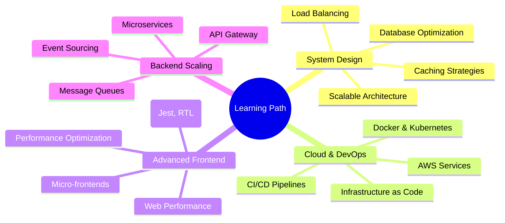

<div align="center">
  


</div>

<h1 align="center">Hi  I'm <b>Saurabh (Full Stack Developer)</b></h1>

<h2 align="center"><b>Building Production-Ready Applications with AI Integration 💻✨</b></h2> 

<p align="center"><b>Full Stack Developer | MERN Stack Specialist | 350+ DSA Problems Solved | AI Integration Expert | Building Scalable Applications | Next.js & TypeScript Enthusiast | Open to SDE Opportunities | Razorpay & GenAI Integration | Event-Driven Architecture | 7th Sem CSE(AI & ML) | CGPA: 7.5/10 | Galgotias College | Real-Time Features Developer | Production Apps Builder | Problem Solving Addict 🧠 | Always Learning, Always Growing 🚀</b></p>

<p align="center">
 <a href="https://linkedin.com/in/yourprofile" target="_blank">
  
 </a>
 <a href="https://github.com/yourusername" target="_blank">
  
 </a>
 <a href="https://leetcode.com/yourprofile" target="_blank">
  
 </a>
 <a href="https://auth.geeksforgeeks.org/user/yourprofile" target="_blank">
  
 </a>
 <a href="mailto:ampsaurabh88877@gmail.com" target="_blank">
  
 </a>
 <a href="https://your-portfolio.com" target="_blank">
  
 </a>
</p>

---


## 👨‍💻 About Me

```javascript
const saurabh = {
    location: "Greater Noida, Uttar Pradesh, India 🇮🇳",
    education: "B.Tech CSE (AI & ML) | GCET",
    currentRole: "Final Year Student | Seeking SDE Roles",
    expertise: ["MERN Stack", "AI Integration", "Real-Time Apps"],
    currentlyLearning: ["System Design", "Docker", "AWS"],
    achievement: "350+ DSA Problems Solved",
    projects: ["SageMate (AI Mental Health)", "Prescripto (Healthcare)"],
    lookingFor: "Full Stack Developer | SDE Opportunities",
    availableFor: "Freelance | Collaborations | Open Source",
    funFact: "I debug with console.log and I'm proud! 😄"
};
```

- 🔥 **Full Stack Developer** specializing in MERN stack with AI integration
- 💻 Built **2+ production-ready applications** with GenAI, Razorpay, Inngest
- 🧠 Solved **350+ DSA problems** on LeetCode & GeeksforGeeks
- 🚀 Expertise in **Next.js, TypeScript, Event-Driven Architecture**
- 🎓 **B.Tech CSE (AI & ML)** | CGPA: 7.5/10 | Graduating Aug 2026
- 🌱 Currently learning **System Design, Docker, and Cloud Technologies**
- 💬 Ask me about **React, Node.js, MongoDB, AI Integration**
- 📫 Reach me: **ampsaurabh88877@gmail.com** | **+91-7355018077**
- ⚡ Fun fact: **Started coding in 2022, haven't stopped since!**

---

## 💼 Featured Projects

<table>
<tr>
<td width="50%" valign="top">

### 🧠 SageMate - AI Mental Health Companion

<a href="https://your-sagemate-demo.com" target="_blank">
  
</a>
<a href="https://github.com/yourusername/sagemate" target="_blank">
  
</a>

**Tech Stack:**  


**Key Features:**
- 🤖 **AI-Powered Therapy** with Google GenAI integration
- 📊 **Analytics Dashboard** with mood tracking & metrics
- 🔒 **Enterprise Security** with JWT & bcrypt encryption
- ⚡ **Event-Driven Architecture** using Inngest
- 🎯 **Real-Time Coping Strategies** & therapeutic exercises
- 📈 **Personalized Goal Management** system

**Impact:**
- Personalized therapy sessions for mental wellness
- Real-time emotional support & guidance
- HIPAA-inspired privacy protocols

</td>
<td width="50%" valign="top">

### 🏥 Prescripto - Doctor Appointment System

<a href="https://your-prescripto-demo.com" target="_blank">
  
</a>
<a href="https://github.com/yourusername/prescripto" target="_blank">
  
</a>

**Tech Stack:**  


**Key Features:**
- 📅 **Appointment Booking** with date/time selection
- 💳 **Secure Payments** via Razorpay integration
- 👥 **Role-Based Dashboards** (Patient/Doctor/Admin)
- 🔐 **JWT Authentication** & authorization
- 📊 **Analytics Overview** for admins
- ⚡ **Optimized MongoDB Queries** for performance

**Impact:**
- Seamless healthcare appointment management
- Secure payment processing
- Improved doctor-patient coordination

</td>
</tr>
</table>

---

## ❤️ I Code on (DSA Platforms)

<p align="left"> 
<a href="https://leetcode.com/yourprofile" target="_blank"></a>
<a href="https://auth.geeksforgeeks.org/user/yourprofile" target="_blank"></a>
<a href="https://www.codechef.com/users/yourprofile" target="_blank"></a>
<a href="https://codeforces.com/profile/yourprofile" target="_blank"></a>
<a href="https://www.hackerrank.com/yourprofile" target="_blank"></a>
</p>

---

## 🏆 Achievements & Milestones

<div align="center">

| 🎯 Metric | 📈 Achievement | 🔥 Status |
|-----------|----------------|-----------|
| 💻 **DSA Problems Solved** |  | **Active** |
| 🚀 **Production Apps** |  | **Live** |
| 🔧 **Technologies Mastered** |  | **Growing** |
| 📜 **Certifications** |  | **Certified** |
| ⭐ **GitHub Contributions** |  | **Daily** |
| 🎓 **CGPA** |  | **Academic** |

</div>

---

## 🏆 DSA Battleground Stats

<div align="center">

### LeetCode Progress
<a href="https://leetcode.com/yourprofile" target="_blank">

</a>

### GeeksforGeeks Stats


</div>

**🚀 My DSA Journey:**
- ✅ **350+ Problems Solved** across LeetCode & GeeksforGeeks
- 🔥 **Consistent Practice** with focus on quality over quantity
- 💡 **Strong Foundation** in Arrays, Trees, Graphs, DP, Greedy
- 🎯 **Problem-Solving Approach:** Understand → Optimize → Code
- 📈 **Growing Streak** of daily coding practice

---

## 🛠️ Technical Skills

<div align="center">

### Languages & Core
<table align="center">
  <tr>
    <td align="center" width="90"><br><b>JavaScript</b></td>
    <td align="center" width="90"><br><b>TypeScript</b></td>
    <td align="center" width="90"><br><b>C++</b></td>
    <td align="center" width="90"><br><b>HTML5</b></td>
    <td align="center" width="90"><br><b>CSS3</b></td>
    <td align="center" width="90"><br><b>SQL</b></td>
  </tr>
</table>

### Frontend Development
<table align="center">
  <tr>
    <td align="center" width="90"><br><b>React.js</b></td>
    <td align="center" width="90"><br><b>Next.js</b></td>
    <td align="center" width="90"><br><b>Tailwind CSS</b></td>
    <td align="center" width="90"><br><b>Redux</b></td>
    <td align="center" width="90"><br><b>Zustand</b></td>
    <td align="center" width="90"><br><b>GSAP</b></td>
    <td align="center" width="90"><br><b>Framer Motion</b></td>
  </tr>
</table>

### Backend & Databases
<table align="center">
  <tr>
    <td align="center" width="90"><br><b>Node.js</b></td>
    <td align="center" width="90"><br><b>Express.js</b></td>
    <td align="center" width="90"><br><b>MongoDB</b></td>
    <td align="center" width="90"><br><b>PostgreSQL</b></td>
    <td align="center" width="90"><br><b>MySQL</b></td>
    <td align="center" width="90"><br><b>Drizzle ORM</b></td>
  </tr>
</table>

### Tools & Technologies
<table align="center">
  <tr>
    <td align="center" width="90"><br><b>Git</b></td>
    <td align="center" width="90"><br><b>GitHub</b></td>
    <td align="center" width="90"><br><b>Postman</b></td>
    <td align="center" width="90"><br><b>VS Code</b></td>
    <td align="center" width="90"><br><b>JWT</b></td>
    <td align="center" width="90"><br><b>Zod</b></td>
  </tr>
</table>

### APIs & Integrations
<table align="center">
  <tr>
    <td align="center" width="110"><br><b>Razorpay</b></td>
    <td align="center" width="110"><br><b>GenAI</b></td>
    <td align="center" width="110"><br><b>Inngest</b></td>
    <td align="center" width="110"><br><b>Cloudinary</b></td>
    <td align="center" width="110"><br><b>WebSocket</b></td>
  </tr>
</table>

</div>

---

## 📊 GitHub Statistics

<div align="center">
  
<a href="https://github.com/yourusername">
  
</a>

<a href="https://github.com/yourusername">
  
</a>

<a href="https://github.com/yourusername">
  
</a>

<a href="https://github.com/yourusername">
  
</a>

</div>

<p align="center">
  <b>Note:</b> Top languages is only a metric of the languages my public code consists of and doesn't reflect experience or skill level.
</p>

---

## 🎓 Experience & Education

### 💼 Professional Experience

#### **IBM SkillBuild Virtual Internship** | Remote
**Frontend Development Intern** | *Jul 2025 – Aug 2025*

- ✅ Completed intensive frontend development training covering **HTML5, CSS3, JavaScript ES6+, React.js**
- ✅ Mastered modern **state management patterns** using Redux and React Hooks
- ✅ Built responsive user interfaces with **best practices in component architecture**
- ✅ Hands-on project implementation with **real-world scenarios**

### 🎓 Education

**Galgotias College of Engineering and Technology** | Greater Noida, India  
**Bachelor of Technology in Computer Science and Engineering (AI & ML)**  
*Nov 2022 – Aug 2026* | **CGPA: 7.5/10**

**Core Subjects:** Data Structures & Algorithms, Operating Systems, Computer Networks, DBMS, OOPs

---

## 📜 Certifications

<div align="center">

| Certification | Issuer | Status |
|--------------|--------|---------|
| 🎓 **Frontend Development** | IBM SkillsBuild | ✅ Certified |
| 🎓 **Full Stack Web Development** | - | ✅ Certified |
| 💻 **350+ DSA Problems** | LeetCode & GeeksforGeeks | 🔥 Ongoing |

</div>

---

## 💡 What I'm Currently Learning

<div align="center">



</div>

---

## 📈 Contribution Graph

<p align="center">
   
</p>

---

## 🏆 GitHub Trophies

<p align="center">
  
</p>

---

## 🐍 Contribution Snake

<p align="center">
  
</p>

---

## 📌 Pinned Repositories

<p align="center">
    <a href="https://github.com/yourusername/sagemate">
        
    </a>
    <a href="https://github.com/yourusername/prescripto">
        
    </a>
</p>

---

## 🤝 Let's Connect & Collaborate

<div align="center">

### 💬 I'm Open To:

🎯 **Full Stack Developer Opportunities** | 🚀 **SDE Roles** | 💡 **Freelance Projects**  
🤝 **Open Source Contributions** | 📈 **Tech Discussions** | ☕ **Coffee Chats about Code**

### 📫 Reach Me At:

<p align="center">
 <a href="https://linkedin.com/in/yourprofile" target="_blank">
  
 </a>
 <a href="https://github.com/yourusername" target="_blank">
  
 </a>
 <a href="https://leetcode.com/yourprofile" target="_blank">
  
 </a>
 <a href="mailto:ampsaurabh88877@gmail.com" target="_blank">
  
 </a>
 <a href="https://your-portfolio.com" target="_blank">
  
 </a>
 <a href="tel:+917355018077" target="_blank">
  
 </a>
</p>

</div>

---

## 💭 Random Dev Quote

<div align="center">


</div>

---

## 📊 Profile Views & Visitors

<div align="center">


<a href="https://github.com/yourusername?tab=followers">
  
</a>

<a href="https://github.com/yourusername?tab=stars">
  
</a>

</div>

---

<div align="center">

### 💖 Thanks for Visiting! 


**⚡ "First, solve the problem. Then, write the code." – John Johnson**

<br>

Made with ❤️ and ☕ by **Saurabh Arimardan Pandey**

<br>


</div>
